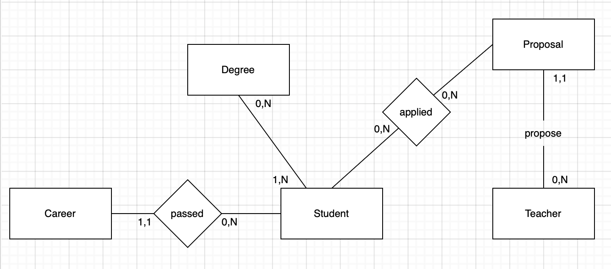

# Thesis Management System

## Update database model, data and rebuild your local database

When adding new tables, altering existing tables or modifying data, you need to update the Thesis-Management-System.sql file.

Do this by adding the SQL Query to the Thesis-Management-System.sql file, then push the changes to the repository so that everyone can benefit from the changes.

To rebuild your local database and align it, run the following commands :

```bash
cd backend
npm run rbrebuild
```

## Conceptual design

The goal is to implement Thesis Management System for PoliTO. The primary entities include "Degree," representing different academic degrees they can be followed my 0 or many students. A student is always associated to one or many degrees.
"Student" contains student information with enrollment details such as the degree.
"Career" contains information about exams taken by a student (cfu, grade, date).
The "Proposals" entity list thesis projects, proposed by teachers.
"Applications" entity tracks student applications for thesis proposals. A student can applied to as many proposal as he wants. A proposal can be applied by 0 or many students.
"StudentNotifs" (Student Notifications) entity contains all the notifications sent to the students.



In this design 4 tables can NOT be modified :

- Teacher
- Student
- Degree
- Career

## Logical design

### Translation of entities and associations

- Degree: [**cod_degree** (PK), **title_degree**]
- Student: [**id** (PK), **surname**, **name**, **gender**, **nationality**, **email**, *cod_degree*, **enrollment_year**]
- Teacher: [**id** (PK), **surname**, **name**, **email**, cod_group, **cod_department**]
- Career: [**id** (PK), **cod_course** (PK), **title_course**, **cfu**, **grade**, **date**]
- Proposals: [**proposal_id** (PK), **title**, *supervisor_id*, **keywords**, **type**, **groups**, **description**, **required_knowledge**, **notes**, **expiration_date**, **level**, **programmes**, **archived**]
- Applications: [**id** (PK), *proposal_id*, *student_id*, **status**, **application_date**]
- StudentNotifs: [**id** (PK), *channel*, *student_id*, *campaign*, *subject*, *content*, *creation*, *status*, *lastupdate*]

## Tables details

### Degrees

| Attribute | Typology | Description |
| --- | --- | --- |
| cod_degree | VARCHAR(10) | The code attributed to a degree (used in student table to specify his track) |
| title_degree | VARCHAR(50) NOT NULL | The title of the degree |

### Student

| Attribute | Typology | Description |
| --- | --- | --- |
| id | VARCHAR(10)  |  Student ID. Starts with S. ex : S001 |
| surname | VARCHAR(50) NOT NULL  | Student's last name |
| name | VARCHAR(50) NOT NULL  | Student's first name |
| email | VARCHAR(255) NOT NULL  | Student email |
| gender | CHAR(1) | F (female), M (male), N (undefined??) |
| nationality | VARCHAR(50) NOT NULL |  Student's nationality. |
| cod_degree | VARCHAR(10) | Code of the degree the student is enrolled in. It refers to the table degrees. (FOREIGN KEY) |
| enrollment_year | INT | Year of enrollment. |

### Teacher

| Attribute | Typology | Description |
| --- | --- | --- |
| id | VARCHAR(10)  |  Teacher ID. Starts with T. ex : T001 |
| surname | VARCHAR(50) NOT NULL  | Teacher last name |
| name | VARCHAR(50) NOT NULL  | Teacher first name |
| email | VARCHAR(255) NOT NULL  | Teachers email |
| cod_group | VARCHAR(10) | Code of the group associated with the teacher. ex : GR-09 - GRAphics and INtelligent Systems. This data will be used in thesis proposals. |
| cod_department | VARCHAR(10)  | Code of the department associated with the teacher |

### Career

This tables tracks the credits, grade, and date or a specific course, passed by a student. A student can have more passed exams: the primary key is the couple (id, cod_course).

| Attribute | Typology | Description |
| --- | --- | --- |
| id | VARCHAR(10) | Student ID (Foreign key). |
| cod_course | VARCHAR(10)  | Code of a specific course. |
| title_course | VARCHAR(50) NOT NULL  | Code of the course associated with the career. |
| cfu | INT NOT NULL  | Credit units for the course. |
| grade |  INT NOT NULL | Grade achieved in the course. |
| date | DATE NOT NULL  | Date of completion of the exam |

### Proposals

Table for all thesis proposals.

| Attribute | Typology | Description |
| --- | --- | --- |
| proposal_id | VARCHAR(10) | Proposal ID. |
| title | VARCHAR(255) NOT NULL |  Title of the proposal. |
| supervisor_id | VARCHAR(10)  | Supervisor's ID. |
| keywords | TEXT[] | List of Keywords associated with the proposal. |
| type | VARCHAR(255)  | Type of the proposal.Ex: THEORETICAL/EXPERIMENTAL  or MODELING AND DATA ANALYSIS, MODELING |
| groups | TEXT[] | Groups associated with the proposal. |
| description | TEXT | Description of the proposal. |
| required_knowledge | TEXT | Required knowledge for the proposal. |
| notes | TEXT | Additional notes for the proposal. |
| expiration_date | DATE | Expiration date of the proposal. |
| level | VARCHAR(30) | Level of the proposal. Graduate/Undergraduate |
| programmes | TEXT[] | All degrees concerned:list of cod_degree |
| archived | BOOLEAN | Tells if the teacher archived this proposal (either manually or after accepting an application) |

### Applications

This table contains all the application associated to a student to a thesis proposal.

The status of an application can be : `Pending, Accepted, Refused`

| Attribute | Typology | Description |
| --- | --- | --- |
| id | SERIAL | ID, auto increment |
| proposal_id |  VARCHAR(10) NOT NULL | Proposal ID. (FOREIGN KEY) |
| student_id |  VARCHAR(10) NOT NULL | Student ID (FOREIGN KEY) |
| status | VARCHAR(255) NOT NULL | Status of the application. Pending, Accepted, Refused |
| application_date | DATE NOT NULL | Date of the application. |

### StudentNotifs

This table contains all the notifications sent to the students.

The data stored in this table are the same that will be sent as notification to the student but doesn't mean it has been sent (see status field).

| Attribute | Typology                         | Description                                                            |
| --- |----------------------------------|------------------------------------------------------------------------|
| id | SERIAL                           | ID, auto increment                                                     |
| channel | VARCHAR(30) NOT NULL             | Channel of the notification. (Email, ...)                              |
| student_id | VARCHAR(10) NOT NULL             | Student ID (FOREIGN KEY)                                               |
| campaign | VARCHAR(30) NOT NULL             | Campaign of the notification (Application Decision, ...)               |
| subject | TEXT NOT NULL                    | Subject of the notification                                            |
| content | JSON NOT NULL                    | JSON data content of the notification                                  |
| creation | TIMESTAMP NOT NULL DEFAULT NOW() | Creation date of the notification                                      |
| status | VARCHAR(30) NOT NULL             | Status of the notification. SMTP Pending, SMTP Accepted, SMTP Rejected |
| lastupdate | TIMESTAMP NOT NULL               | Last update date of the notification status                            |

## How to install ?

Refers to Elio documentation for DBEaver or to Docker compose documentation. 😃

If you experienced error using DBEaver, try to drop the database from your terminal : `dropdb Thesis-Management-System`

### ***Database Access via Terminal***

To access the database via the command line, we use the 

`psql -U postgres -W` command, and it will prompt us to enter the password. 

Once we are granted access, we can type the command `\l`to view the list of all databases in the system, including “Thesis-Management-System”.

Using the command `\c Thesis-Management-System`, we can select the desired database (this may prompt us to enter the password again). With the command `\d`, we can retrieve a list of all available tables.

Alternatively, we can log out using `\q` and then enter the command `psql -d Thesis-Management-System -U postgres -W`, where, after entering the correct password, we will be directly logged into the specified database.